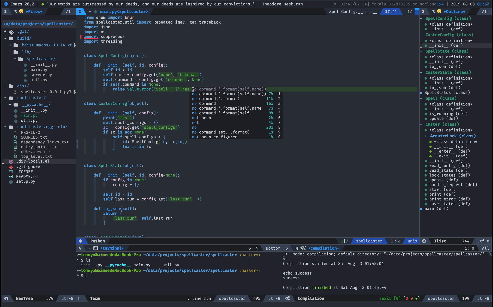

# TommyX's Emacs Configuration



## Installation

- Clone this repository with submodule.
  ```bash
  git clone --recursive https://github.com/TommyX12/tommyx-emacs.git
  ```
- Copy the content of `add-to-emacs.el` to your emacs configuration (such as `~/.emacs`). Make sure to change parts of it (such as path to `tommyx-emacs`) after copying.

## Dependency Installation

- `all-the-icons`
  - Run `M-x all-the-icons-install-fonts`.
- `company-tabnine`
  - Run `M-x company-tabnine-install-binary`.
- `rg`
- `ycmd`
- `elpy`
